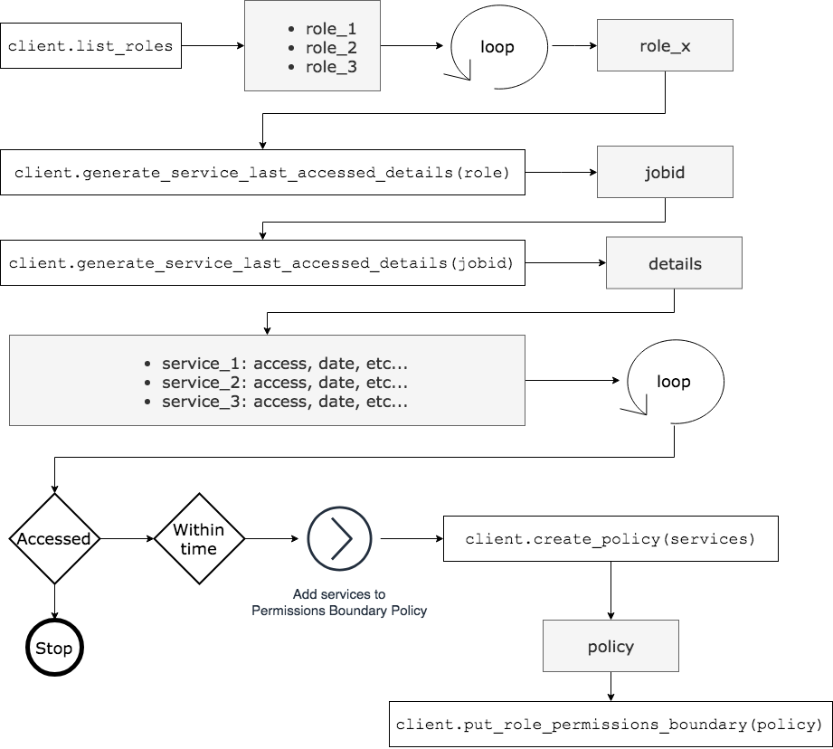
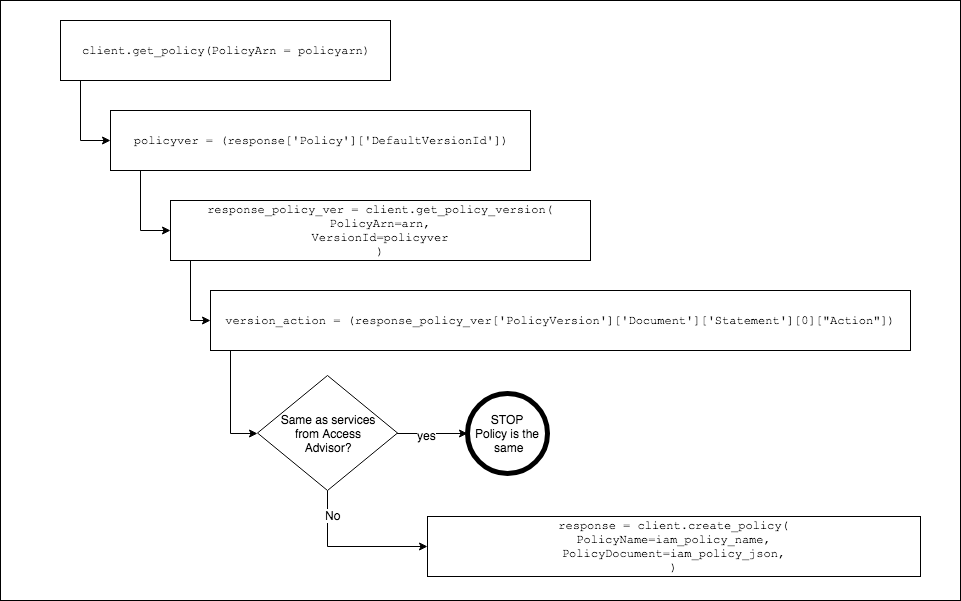

# AWS IAM Access Advisor Permission Boundary

Audit IAM roles and users using Access Advisor data using Python/boto3 SDK and automatically create IAM permissions boundaries to limit access

## License

This library is licensed under the Apache 2.0 License. 

## Description
**Classify and Enforce Least Privileged Access with AWS Access Advisor, IAM Permissions Boundary & boto3**

### Overview

Access Advisor Automation has been developed to provide two main functions. First is to regularly review data from 
AWS Access Advisor and provide ability to audit IAM roles, users and groups based on their previous access to services 
as reported by AWS Access Advisor.  The data is then used by this program to tag IAM entities with, number of services 
entities has access to, number of services they actually accessed in a configurable expiration period and percentage of
actual access that was used compared to granted.  Second function is based on the services entity used within the 
expiration period, the program generates a permissions boundary and applies it to the user or role entity, effectively 
limiting access to only services accessed during the defined period.  The supplied Cloudformation template deploys 
the program into a lambda function as well as Cloudwatch Event that is configured to kick off Lambda function based 
on defined time period.  The Lambda function can be configured to run regularly to review and adjust access given to 
users to restricted unnecessary permissions and make defining least privileged access easier and more automated. 
 
### Features

Automating audit of least privileged access across AWS IAM entities (users, roles and groups) and restricting access 
to unused services with IAM permissions boundaries. Automatically assigning permissions boundary to limit access to 
only services accessed within expiration period. If service is not accessed within expiration period it is not 
included in the permissions boundary effectively removing access to the service.

Tagging IAM entities with access summary data. Total permissions granted, permissions used and % of permissions used.
Tagging with services used be the IAM entity. 

Tag a user and/or role with:

    Permissions Coverage - Percentage
    Permissions Granted - Total
    Permissions Unused - Total

Configurable expiration period. If service is not accessed within the expiration period its, not included in permissions
boundary. Automatically creating and apply permissions boundaries to IAM users and roles based on Access Advisor data.

Exception list that can be saved on S3 and accessed by the program during runtime. 

Included Cloudformation template deploys everything required to run this program as a lambda function, as well as 
time based Cloudwatch Event configured to be kicked off every 90 days.  This threshold can be change in CF template.
For accounts with large number of IAM entities, lambda function may no have a enough time to finish assessing all entities. You may
consider deploying this program as a set step functions or a container.  

Access Advisor shows the service permissions granted to a role and when permissions were used to access services last. 
You can use this information to revise your policies.
http://docs.aws.amazon.com/console/iam/access-advisor-intro

Note: Recent activity usually appears within 4 hours. Data is stored for a maximum of 365 days, depending when your 
region began supporting this feature.
http://docs.aws.amazon.com/console/iam/access-advisor-regional-tracking-period

This program is created to help AWS Customers achieve least privileged access. Using Access Advisor APIs it help to
identify IAM Roles that may have unnecessary privileges.  

#### Added 03/2019

1. Enforce yes/no switch, set to no if you do not want to create permissions boundaries.
2. do_not_list now applies to policy creation, policies will not be created for entities in do_not_list
3. Base Permissions Boundary, saved in file in the same S3 bucket. base_actions.txt
4. Enhanced calculation of the permissions coverage
5. Updated CF template to provided additional variables

Limitation: Currently IAM Group resources can not be tagged. Users are tagged instead. 
### Archtiecture Diagram

### Application Logic

### Creating and Applying Permissions Boundary
 

### Use Cases

### IAM Policy for Lambda
Required IAM policy for lambda role

    {
    "Version": "2012-10-17",
    "Statement": [
        {
            "Action": [
                "iam:GetServiceLastAccessedDetailsWithEntities",
                "iam:GenerateServiceLastAccessedDetails",
                "iam:GetServiceLastAccessedDetails",
                "iam:TagRole",
                "iam:ListUsers",
                "iam:ListRoles",
                "iam:ListGroups",
                "iam:TagUser",
                "iam:GetPolicy",
                "iam:GetPolicyVersion",
                "iam:CreatePolicy",
                "iam:PutUserPermissionsBoundary",
                "iam:PutRolePermissionsBoundary",
                "iam:CreatePolicyVersion",
                "iam:DeletePolicyVersion"
                "s3:List*",
                "s3:Get*",
                "kms:Decrypt"
            ],
            "Resource": [
                "*"
            ],
            "Effect": "Allow",
            "Sid": "AccessAdvisorautomation"
        },
        {
            "Action": [
                "logs:CreateLogGroup",
                "logs:CreateLogStream",
                "logs:PutLogEvents"
            ],
            "Resource": [
                "*"
            ],
            "Effect": "Allow",
            "Sid": "CloudwatchLogs"
        }
    ]
}

### Tagging
The program will tag each IAM user and Role with tags, summary of permissions granted and services accessed.

#### Exception, Do_not_list

1. Exclude from tagging
2. Exclude from permissions boundary & policy creation

You may choose to not tag some roles or users with every service they use or not to apply permissions boundary.
You may use 'do_not_tag' list and safe it to S3. 

    user1,
    user2,
    user3,
    role1,
    role2,
    role2

### Base Permissions Boundary
Set list of Actions to be configured in policies for IAM entities that have not accessed services.  This will be applied as
permissions boundary to these IAM entities. 

Sample file is base_actions.txt
    
    ec2:DescribeInstances,
    ec2:DescribeTags,
    redshift:DescribeEvents,
    ec2:DescribeRegions,
    redshift:ViewQueriesInConsole,
    redshift:DescribeTags,
    redshift:DescribeClusterParameterGroups,
    ec2:DescribeSnapshots,
    ec2:DescribeHosts,
    ec2:DescribeImages,
    s3:ListAllMyBuckets,
    redshift:DescribeClusterVersions,
    redshift:DescribeClusters,
    s3:HeadBucket,
    redshift:DescribeClusterParameters,
    ec2:DescribeInstanceStatus,
    s3:ListBucket
    
### Logging 
Logging is standardized using json format. Mostly :-)

#### Defining standard logging module

* msgtype - detail; summary
* entitytype - user, role, group
* entityname - name of the entity
* service - name of the services
* TotalAuthenticatedEntities = number of authenticated entities for the service
* message - any custom messages

#### Searching Logs
In Cloudwatch Logs search for (examples): 
    
    1. start
    2. msgtype
    3. msgtype summary
    4. policy 
    5. policy validation
    6. POLICY VERSION WAS SUCCESSFULLY CREATED
    7. policy matches
    8. end_execution # end of the program execution
    9. start_execution # start of the program execution and it's configuration  
    

### Packaging & Deployment

For the included Cloudformation template, set handler to (the python file name should match the handler "accessadvisor_automation.py": 

    accessadvisor_automation.lambda_handler

You can of course change in the template. 
    
* If you would like to exclude some users from being tagged with every service they accessed, add them to "do_not_tag" list *
* Set lambda function time to maximum of 15min. 

**Prerequisite: Latest boto3 SDK**

### Building Lambda Layer
*You will need to build a lambda layer with boto3 SDK.* 
    
        pip install boto3 --target python/.   
        # install botocore
        pip install botocore --target python/.
        # zip to four layer
        zip boto3layer.zip -r python/
        aws lambda publish-layer-version --layer-name boto3-layer --zip-file fileb://boto3layer.zip
        

    
 *If user have not used any of granted permissions, there is nothing add to the Permissions Boundary, "Action" 
 can not be empty.  We have 2 options, 1. remove all policies from IAM entity 2. Add a default Permissions Boundary.
 the script will implement default permission boundary*
 

