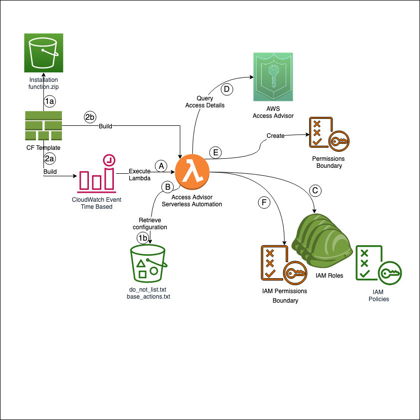

# AWS IAM Access Advisor Permission Boundary

Audit IAM roles and users using Access Advisor data using Python/boto3 SDK and automatically create IAM permissions boundaries to limit access

## License

This library is licensed under the Apache 2.0 License. 

## Description
**Classify and Enforce Least Privileged Access with AWS Access Advisor, IAM Permissions Boundary & boto3.**
Automating audit of permissions based on history of access across AWS IAM entities (users, roles and groups) and restricting access 
to unused services with IAM permissions boundaries. Automatically assigning permissions boundary to limit access to 
only services accessed within expiration period. If service is not accessed within expiration period it is not 
included in the permissions boundary effectively removing access to the service.

## Overview

### What is Access Advisor? 
Access Advisor shows the service permissions granted to a role and when permissions were used to access a service last. 
You can use this information to revise your policies.
http://docs.aws.amazon.com/console/iam/access-advisor-intro

Note: Recent activity usually appears within 4 hours. Data is stored for a maximum of 365 days, depending on when AWS 
region began supporting this feature.
http://docs.aws.amazon.com/console/iam/access-advisor-regional-tracking-period

### What is Permission Boundary?
AWS supports [permissions boundaries](https://docs.aws.amazon.com/IAM/latest/UserGuide/access_policies_boundaries.html) 
for IAM entities (users or roles). A permissions boundary is an advanced feature 
for using a managed policy to set the maximum permissions that an identity-based policy can grant to an IAM entity. An 
entity's permissions boundary allows it to perform only the actions that are allowed by both its identity-based policies
and its permissions boundaries.

### Features
Access Advisor Permission Boundary automation script has benn created to help AWS customers achieve least privileged access as well
as remove access form users and roles that have not been used within configurable expiration period. 
The script provide two main functions: First it regularly review data from 
AWS Access Advisor and provide ability to audit IAM roles, users and groups based on their previous access to services 
as reported by AWS [Access Advisor](https://docs.aws.amazon.com/IAM/latest/UserGuide/access_policies_access-advisor-view-data.html).  
The data is then used by the script to tag IAM entities with:
 * number of services entities have access to,
 * number of services actually accessed in a configurable expiration period, and
 * and percentage of actual access that was used compared to granted.  
 
Second feature is based on the services entity used within the expiration period, the script generates a permissions boundary and applies it to the user or role entity, effectively limiting access to only services accessed during the defined period.  The supplied Cloudformation template deploys 
the program into a lambda function as well as Cloudwatch Event that is configured to kick off Lambda function based 
on defined time period.  The Lambda function can be configured to run regularly to review and adjust access given to 
users to restricted unnecessary permissions and make defining least privileged access easier and more automated. 

Tagging IAM entities with access summary data. Total permissions granted, permissions used and % of permissions used.
Tagging with services used be the IAM entity. 

#### Tag a user and/or role with:

    Permissions Coverage - Percentage
    Permissions Granted - Total
    Permissions Unused - Total

Configurable expiration period through Cloudformation template parameter allows permissions to be restricted based on 
usage history and if permissions are unused they are restricted with permissions boundary reducing blast radius of each 
AIM entity within AWS account. If service is not accessed within the expiration period 
its, not included in permissions boundary.

Configurable exception list that can be saved as a file on S3 and accessed by the program during runtime. Make sure that
the lambda function role has access to read the S3 object. 

### Installation

Included Cloudformation template deploys everything required to run this program as a lambda function, as well as 
time based Cloudwatch Event configured to be kicked off every 90 days.  This threshold can be change in CF template.
* For accounts with large number of IAM entities, lambda function may no have a enough time to finish assessing all entities. You may
consider deploying this program as a set of step functions or a container. 

**Prerequisite: Latest boto3 SDK**

### Building Lambda Layer
*You will need to build a lambda layer with boto3 SDK.* 
    
        pip install boto3 --target python/.   
        # install botocore
        pip install botocore --target python/.
        # zip to four layer
        zip boto3layer.zip -r python/
        aws lambda publish-layer-version --layer-name boto3-layer --zip-file fileb://boto3layer.zip
        
 

Limitation: Currently IAM Group resources can not be tagged. Users are tagged instead. 
### Archtiecture Diagram

Deployment Process:
 - 1a. Place installation files into an S3 bucket where CloudFormation has access to these files. This is an optional step as you can use the bucket included in CloudFormation. 
 - 1b. Place configuration files into the S3 bucket.
 - 2a & 2b Build required infrastructure componets to run the solution. 

Execution Process:
- A.	Time-based CloudWatch Event Rule triggers Lambda function.
- B.	Lambda function retrieves configuration files.
- C.	Retrieve list of IAM roles.
- D.	Obtain access advisor report for each IAM role.
- E.	Using data in the access advisor report, create IAM policy, which will be used as a permissions boundary.
- F.	Apply permissions boundary and tag IAM role

### IAM Policy for Lambda
Required IAM policy for lambda role

    {
    "Version": "2012-10-17",
    "Statement": [
        {
            "Action": [
                "iam:GetServiceLastAccessedDetailsWithEntities",
                "iam:GenerateServiceLastAccessedDetails",
                "iam:GetServiceLastAccessedDetails",
                "iam:TagRole",
                "iam:ListUsers",
                "iam:ListRoles",
                "iam:ListGroups",
                "iam:TagUser",
                "iam:GetPolicy",
                "iam:GetPolicyVersion",
                "iam:CreatePolicy",
                "iam:PutUserPermissionsBoundary",
                "iam:PutRolePermissionsBoundary",
                "iam:CreatePolicyVersion",
                "iam:DeletePolicyVersion"
                "s3:List*",
                "s3:Get*",
                "kms:Decrypt"
            ],
            "Resource": [
                "*"
            ],
            "Effect": "Allow",
            "Sid": "AccessAdvisorautomation"
        },
        {
            "Action": [
                "logs:CreateLogGroup",
                "logs:CreateLogStream",
                "logs:PutLogEvents"
            ],
            "Resource": [
                "*"
            ],
            "Effect": "Allow",
            "Sid": "CloudwatchLogs"
        }
    ]
}

### Exception

Exceptions are supported via do_no_list.txt file. The file should be stored in s3, where lambda function will have access
to retrieve the file.  The file should contain list of users and or roles that should be excluded. The list is s3 object
is configurable during Cloudformation deployment.

1. Exclude from tagging
2. Exclude from permissions boundary & policy creation

You may choose to not tag some roles or users with every service they use or not to apply permissions boundary.
You may use 'do_not_tag' list and safe it to S3. 

    user1,
    user2,
    user3,
    role1,
    role2,
    role2

### Base Permissions Boundary
Set list of Actions to be configured in policies for IAM entities that have not accessed services.  This will be applied
as permissions boundary to these IAM entities. 

Sample file is base_actions.txt
    
    ec2:DescribeInstances,
    ec2:DescribeTags,
    redshift:DescribeEvents,
    ec2:DescribeRegions,
    redshift:ViewQueriesInConsole,
    redshift:DescribeTags,
    redshift:DescribeClusterParameterGroups,
    ec2:DescribeSnapshots,
    ec2:DescribeHosts,
    ec2:DescribeImages,
    s3:ListAllMyBuckets,
    redshift:DescribeClusterVersions,
    redshift:DescribeClusters,
    s3:HeadBucket,
    redshift:DescribeClusterParameters,
    ec2:DescribeInstanceStatus,
    s3:ListBucket
    
### Logging 
Logging is standardized using json format. Mostly :-)

#### Defining standard logging module

* msgtype - detail; summary
* entitytype - user, role, group
* entityname - name of the entity
* service - name of the services
* TotalAuthenticatedEntities = number of authenticated entities for the service
* message - any custom messages

#### Searching Logs
In Cloudwatch Logs search for (examples): 
    
    1. start
    2. msgtype
    3. msgtype summary
    4. policy 
    5. policy validation
    6. POLICY VERSION WAS SUCCESSFULLY CREATED
    7. policy matches
    8. end_execution # end of the program execution
    9. start_execution # start of the program execution and it's configuration  
    

### Packaging & Deployment

For the included Cloudformation template, set handler to (the python file name should match the handler "accessadvisor_automation.py": 

    accessadvisor_automation.lambda_handler

You can of course change in the template. 
    
* If you would like to exclude some users from being tagged with every service they accessed, add them to "do_not_tag" list *
* Set lambda function time to maximum of 15min. 

 

